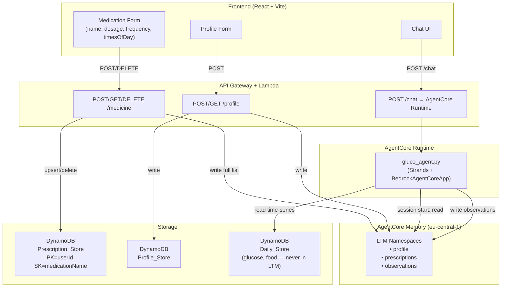

# Design Document: Medication Redesign & AgentCore Long-Term Memory

## Overview

This document covers the technical design for two interrelated changes to GlucoAI:

1. **Prescription Data Model** — Replace the daily medication intake log with a prescription-based model. Each medication is a single ongoing record per user (upsert semantics), with no date/time-of-intake fields.

2. **AgentCore Long-Term Memory (LTM) Integration** — The Strands agent gains persistent memory via the `bedrock-agentcore` SDK. On session start it loads profile, prescriptions, and observations from LTM and injects them into its system prompt. Profile and prescription saves trigger LTM writes. The agent can write observations back to LTM during conversations.

The two changes are coupled: the new prescription model defines the shape of data written to LTM, and the LTM integration depends on the new prescription schema.

---

## Architecture



Key design decisions:

- **LTM is a read-optimised cache** for agent context only. DynamoDB remains authoritative for all records.
- **LTM writes are fire-and-forget** from the API perspective: a failed LTM write logs an error but returns HTTP 200 to the frontend.
- **AgentCore memory mode starts at `STM_ONLY`** for stability, with a clear migration path to `STM_AND_LTM`.
- **No date/time-of-intake on prescriptions** — the model represents ongoing treatment, not daily events.

---

## Components and Interfaces

### 1. Frontend — Medication Form (`App.jsx`)

**State changes:**

```js
// Remove: date, time (clock)
// Add: frequency, timesOfDay
const [newMed, setNewMed] = useState({
  name: '',
  dosage: '',
  frequency: '',       // 'once_daily' | 'twice_daily' | 'three_times_daily' | 'as_needed'
  timesOfDay: [],      // ['morning', 'evening', 'with_meals'] (multi-select)
});
```

**`addMedication()` payload:**

```js
{
  userId,
  medicationName: newMed.name,
  dosage: newMed.dosage,
  frequency: newMed.frequency,
  timesOfDay: newMed.timesOfDay,   // array
}
```

**`fetchMedications()` mapping:**

```js
const meds = result.data.map(item => ({
  id: item.medicationName,         // stable key (no timestamp)
  name: item.medicationName,
  dosage: item.dosage,
  frequency: item.frequency,
  timesOfDay: item.timesOfDay,
}));
```

**Validation:** `name`, `dosage`, and `frequency` are required. `timesOfDay` is optional (empty array is valid for `as_needed`).

**Delete:** sends `DELETE /medicine?medicationName=<name>` and removes the entry from local state on success.

**Display:** each list item shows `name • dosage • frequency label • timesOfDay labels`.

Frequency display labels:

| Value | Label |
|---|---|
| `once_daily` | Once daily |
| `twice_daily` | Twice daily |
| `three_times_daily` | Three times daily |
| `as_needed` | As needed |

### 2. API Lambda — `/medicine`

**POST handler:**

1. Validate body: `medicationName`, `dosage`, `frequency` required → 400 if missing.
2. DynamoDB `PutItem` with `PK=userId`, `SK=medicationName` (upsert).
3. Fetch full prescription list for user from DynamoDB.
4. Write full list to LTM (fire-and-forget, log on failure).
5. Return 200.

**GET handler:**

1. DynamoDB `Query` by `userId`.
2. Return `{ data: [...prescriptions] }`.

**DELETE handler:**

1. DynamoDB `DeleteItem` by `(userId, medicationName)`.
2. Fetch updated full list from DynamoDB.
3. Write updated list to LTM (fire-and-forget).
4. Return 200.

### 3. API Lambda — `/profile`

**POST handler (additions):**

After the existing DynamoDB write, add:

1. Build LTM profile payload (only: `diabetesType`, `age`, `weight`, `height`, `targetGlucoseRange`, `preferredUnits`).
2. Write to LTM under `profile` namespace (upsert).
3. Log on failure, return 200 regardless.

### 4. Agent — `gluco_agent.py`

**Configuration change** (`.bedrock_agentcore.yaml`):

```yaml
memory:
  mode: STM_ONLY
  memory_name: gluco-ai-memory
```

**Session start context loading:**

```python
from bedrock_agentcore.memory import MemoryClient

memory_client = MemoryClient(region_name="eu-central-1")

def load_session_context(user_id: str, memory_id: str) -> str:
    """Load profile, prescriptions, and observations from LTM."""
    try:
        profile = memory_client.retrieve(memory_id=memory_id, namespace="profile", user_id=user_id)
        prescriptions = memory_client.retrieve(memory_id=memory_id, namespace="prescriptions", user_id=user_id)
        observations = memory_client.retrieve(memory_id=memory_id, namespace="observations", user_id=user_id)
        return build_context_block(profile, prescriptions, observations)
    except Exception as e:
        logger.error(f"LTM retrieval failed for user {user_id}: {e}")
        return ""
```

**System prompt injection:**

```python
@app.entrypoint
def strands_agent_bedrock(payload):
    user_id = payload.get("userId")
    user_input = payload.get("prompt")
    memory_id = os.environ.get("MEMORY_ID")

    context = load_session_context(user_id, memory_id)
    dynamic_system_prompt = BASE_SYSTEM_PROMPT + context

    session_agent = Agent(
        model=model_id,
        system_prompt=dynamic_system_prompt,
        tools=[write_observation],
    )
    response = session_agent(user_input)
    return response.message['content'][0]['text']
```

**Observation writing tool:**

```python
@tool
def write_observation(description: str, confidence: str) -> str:
    """Write a detected glucose pattern observation to LTM."""
    # Fetch existing observations, enforce 20-item cap, upsert
    ...
```

---

## Data Models

### Prescription (DynamoDB)

| Attribute | Type | Notes |
|---|---|---|
| `userId` | String | Partition key |
| `medicationName` | String | Sort key |
| `dosage` | String | e.g. "500mg" |
| `frequency` | String | Enum: `once_daily` \| `twice_daily` \| `three_times_daily` \| `as_needed` |
| `timesOfDay` | List\<String\> | Subset of `["morning", "evening", "with_meals"]` |

No `date`, `timestamp`, or `timeOfDay` (clock time) fields.

### LTM Namespaces

**`profile` namespace** (one record per user, upsert):

```json
{
  "diabetesType": "Type 2",
  "age": 45,
  "weight": 82,
  "height": 175,
  "targetGlucoseRange": "80-140",
  "preferredUnits": "mg/dL"
}
```

No `fullName`, `email`, or other PII beyond the listed fields.

**`prescriptions` namespace** (full list, replaced on each save/delete):

```json
[
  {
    "medicationName": "Metformin",
    "dosage": "500mg",
    "frequency": "twice_daily",
    "timesOfDay": ["morning", "evening"]
  }
]
```

**`observations` namespace** (array, max 20, oldest replaced when full):

```json
[
  {
    "description": "Post-meal glucose spikes typically +40 mg/dL within 90 minutes",
    "detectedDate": "2025-10-14",
    "confidence": "high"
  }
]
```

### AgentCore Memory Configuration (`.bedrock_agentcore.yaml`)

```yaml
memory:
  mode: STM_ONLY          # initial; migrate to STM_AND_LTM when validated
  memory_id: <id>         # populated after memory resource creation
  memory_arn: <arn>
  memory_name: gluco-ai-memory
  event_expiry_days: 30
```

---

## Correctness Properties

*A property is a characteristic or behavior that should hold true across all valid executions of a system — essentially, a formal statement about what the system should do. Properties serve as the bridge between human-readable specifications and machine-verifiable correctness guarantees.*

### Property 1: Prescription exact fields invariant

*For any* Prescription object written to or read from Prescription_Store, it SHALL contain exactly the fields `medicationName`, `dosage`, `frequency`, and `timesOfDay`, and SHALL NOT contain `date`, `timestamp`, or `timeOfDay` (clock time).

**Validates: Requirements 1.1, 1.2**

---

### Property 2: Prescription upsert uniqueness

*For any* `userId` and `medicationName`, after any sequence of save operations, Prescription_Store SHALL contain exactly one record for that `(userId, medicationName)` pair.

**Validates: Requirements 1.3, 1.4**

---

### Property 3: Prescription persistence round-trip

*For any* valid Prescription, writing it to Prescription_Store and then reading it back SHALL return a record with the same field values.

**Validates: Requirements 1.5, 3.1, 3.2**

---

### Property 4: Form validation blocks submission on missing required fields

*For any* combination of missing values among `name`, `dosage`, and `frequency`, submitting the medication form SHALL NOT send a network request and SHALL display a validation message.

**Validates: Requirements 2.4, 3.4**

---

### Property 5: Prescription POST payload shape

*For any* valid form submission, the POST request body sent to `/medicine` SHALL contain `medicationName`, `dosage`, `frequency`, and `timesOfDay`, and SHALL NOT contain `date`, `timestamp`, or `timeOfDay`.

**Validates: Requirements 2.3, 3.5**

---

### Property 6: Medication list renders all required fields

*For any* Prescription in the medications list, the rendered list item SHALL display the medication name, dosage, frequency label, and time(s) of day.

**Validates: Requirements 2.7**

---

### Property 7: Add then delete round-trip restores list

*For any* Prescription that is added and then deleted, the medications list SHALL return to its state before the add, and the DELETE request SHALL be sent to the API.

**Validates: Requirements 2.6, 3.3**

---

### Property 8: API returns 400 for missing required fields

*For any* POST `/medicine` request missing one or more of `medicationName`, `dosage`, or `frequency`, the API SHALL return HTTP 400 with a descriptive error message.

**Validates: Requirements 3.4**

---

### Property 9: Session start loads all context types from LTM

*For any* new session with a `userId` that has stored LTM data, the agent SHALL retrieve profile, prescriptions, and observations from LTM before processing the first user message, and all retrieved data SHALL be present in the system prompt for that session.

**Validates: Requirements 5.1, 5.2, 5.3, 5.5**

---

### Property 10: LTM failure does not fail session or API response

*For any* LTM read or write failure (network error, service unavailable), the agent SHALL continue the session without memory context, and the API SHALL return HTTP 200 to the frontend — the failure SHALL be logged but SHALL NOT propagate to the caller.

**Validates: Requirements 5.6, 6.5, 7.5**

---

### Property 11: Profile save writes correct fields to LTM

*For any* profile save, the LTM write payload SHALL contain exactly `diabetesType`, `age`, `weight`, `height`, `targetGlucoseRange`, and `preferredUnits`, and SHALL NOT contain `fullName`, `email`, or other PII fields.

**Validates: Requirements 6.2, 6.3, 6.4, 6.6**

---

### Property 12: Prescription save writes correct fields to LTM

*For any* prescription save or delete, the LTM write SHALL contain the full updated prescription list, and each entry SHALL contain exactly `medicationName`, `dosage`, `frequency`, and `timesOfDay`, with no `date`, `timestamp`, or intake-event fields.

**Validates: Requirements 7.1, 7.2, 7.3, 7.4**

---

### Property 13: Observation structure invariant

*For any* observation written to LTM by the agent, it SHALL contain `description` (string), `detectedDate` (date string), and `confidence` (one of `low`, `medium`, `high`).

**Validates: Requirements 8.1, 8.2**

---

### Property 14: Observation count cap at 20

*For any* user, after any number of observation writes, the total number of stored observations in LTM SHALL never exceed 20, with the oldest observation replaced when the limit is reached.

**Validates: Requirements 8.4, 8.5**

---

### Property 15: DynamoDB is source of truth on LTM divergence

*For any* state where LTM prescriptions differ from Prescription_Store, the next successful save or delete operation SHALL overwrite LTM with the current Prescription_Store contents, restoring consistency.

**Validates: Requirements 9.4, 9.5**

---

## Error Handling

| Scenario | Behaviour |
|---|---|
| LTM read fails on session start | Log error, continue session with empty context (no error to user) |
| LTM write fails after DynamoDB write | Log error, return HTTP 200 to frontend (DynamoDB write is authoritative) |
| POST `/medicine` missing required fields | Return HTTP 400 with field-level error message |
| DynamoDB write fails | Return HTTP 500, do not attempt LTM write |
| AgentCore Memory service unavailable | Treat as LTM read/write failure (log + continue) |
| Frontend form submitted with missing fields | Display inline validation message, block network request |
| DELETE with unknown `medicationName` | DynamoDB `DeleteItem` is idempotent; return 200 |

---

## Testing Strategy

### Unit Tests

Focus on specific examples, edge cases, and integration points:

- Medication form renders with frequency dropdown and timesOfDay checkboxes, without date/time clock inputs (Requirements 2.1, 2.2)
- `addMedication()` sends correct payload shape (Requirement 2.3)
- `fetchMedications()` maps new fields correctly (Requirement 2.7)
- API Lambda returns 400 for each combination of missing required fields (Requirement 3.4)
- `load_session_context()` returns empty string when LTM raises an exception (Requirement 5.6)
- Profile LTM payload excludes `fullName` and `email` (Requirement 6.4)
- Observation write enforces 20-item cap by replacing oldest entry (Requirement 8.5)

### Property-Based Tests

Use **Hypothesis** (Python) for backend/agent tests and **fast-check** (JavaScript) for frontend tests. Each property test runs a minimum of 100 iterations.

Each test is tagged with a comment referencing the design property:
`# Feature: gluco-ai-medication-and-memory, Property N: <property_text>`

| Property | Test description | Library |
|---|---|---|
| P1 | Generate random Prescription dicts; assert exact keys present, no date/timestamp | Hypothesis |
| P2 | Generate random sequences of upserts for same (userId, medicationName); assert count == 1 | Hypothesis |
| P3 | Generate random Prescriptions; write then read; assert field equality | Hypothesis |
| P4 | Generate random subsets of missing required fields; assert no fetch call and validation message shown | fast-check |
| P5 | Generate random valid form states; assert POST body shape | fast-check |
| P6 | Generate random Prescription objects; render list item; assert all four fields present in output | fast-check |
| P7 | Generate random Prescription; add then delete; assert list length unchanged and DELETE called | fast-check |
| P8 | Generate random payloads missing one or more required fields; assert HTTP 400 | Hypothesis |
| P9 | Mock LTM with random profile/prescription/observation data; start session; assert all data in system prompt | Hypothesis |
| P10 | Mock LTM to raise exception; assert session continues and API returns 200 | Hypothesis |
| P11 | Generate random profile objects; assert LTM payload contains exactly the six allowed fields | Hypothesis |
| P12 | Generate random prescription lists; assert LTM payload shape per entry | Hypothesis |
| P13 | Generate random observation writes; assert structure invariant | Hypothesis |
| P14 | Write more than 20 observations; assert stored count <= 20 and oldest is replaced | Hypothesis |
| P15 | Set up diverged LTM/DynamoDB state; trigger save; assert LTM matches DynamoDB | Hypothesis |

**Property-based testing configuration:**

```python
# Hypothesis settings (conftest.py or settings decorator)
from hypothesis import settings
settings.register_profile("ci", max_examples=100)
settings.load_profile("ci")
```

```js
// fast-check configuration
fc.assert(fc.property(...), { numRuns: 100 });
```
