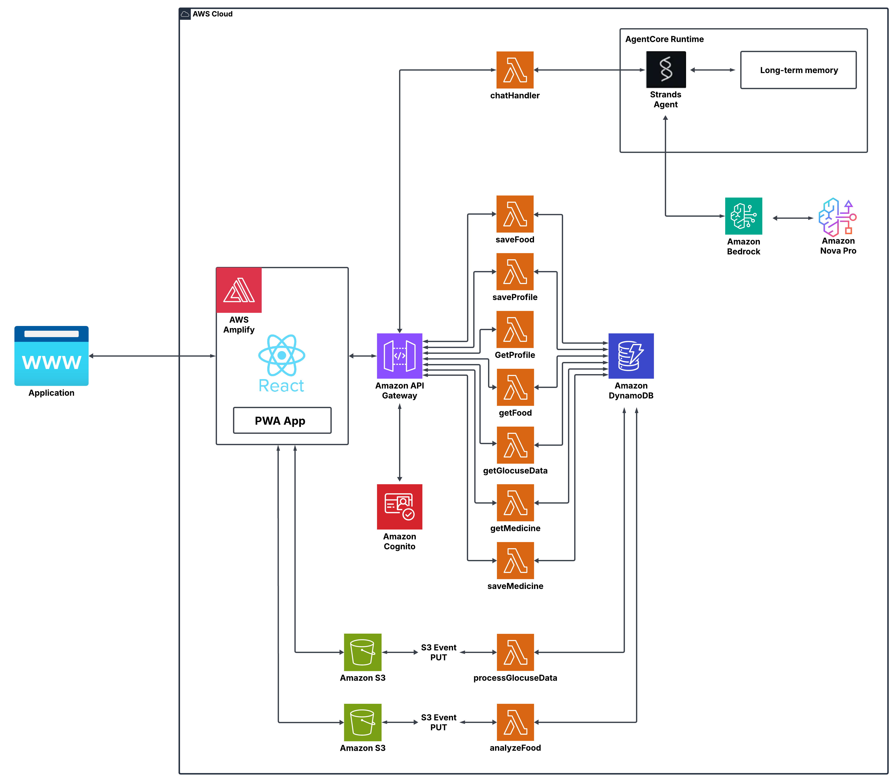

# GlucoAI — AI-Powered Glucose Monitoring
**GlucoAI** is an intelligent health assistant designed to simplify diabetes management by integrating glucose, medication, and food data into one easy-to-use dashboard.

**Diabetes is one of the most severe global health epidemics.**

According to the International Diabetes Federation, more than **500 million adults** are living with diabetes today — a **lifelong disease with no cure**, requiring continuous monitoring and management.

In many developing countries, **awareness and access to diabetes care remain limited**. Many patients lack proper insurance coverage or specialist guidance. Meanwhile, managing glucose can be overwhelming — every brand of CGM (Continuous Glucose Monitor) has its own app interface, making integration difficult. Tracking food intake manually is time-consuming, tedious, and prone to errors.
Together, these hurdles make diabetes management a **constant uphill battle**.
**Our goal:** to empower people with diabetes — and anyone seeking optimal glucose health — to make **informed, data-driven lifestyle decisions**, accessible anytime, anywhere.

# 🚀 Features
## 📱 Personal Health Profile:
Users can create and update their personal health profiles, including medication intake and glucose readings.

## 🍎 Smart Food Detection (Computer Vision):
Upload a photo of your meal, and GlucoAI automatically detects food items and estimates nutritional values using image recognition models.

## 📊 Unified Health Dashboard:
Visualize key patterns and correlations between glucose levels, food intake, and medications.

## 💬 AI Health Assistant (Chat):
Ask GlucoAI questions about your glucose trends, medication effects, and food recommendations — powered by LLM integration.

## 🔒 Data Privacy:
All personal data is processed securely and used solely for personalized insights.

# GlucoAI Architecture

## 🏗️ Components

### **Frontend**
- **React PWA (Progressive Web App)** hosted via **AWS Amplify**.
- Provides an intuitive UI for users to interact with the AI agent.

### **API Layer**
- **Amazon API Gateway** manages communication between the frontend and backend Lambda functions.

### **Backend Logic**
All core business logic is implemented as **AWS Lambda functions**, including:
- `chatHandler` – Handles user messages and communicates with the Strands Agent.
- `saveProfile`, `saveFood`, `saveMedicine` – Persist user data to DynamoDB.
- `getProfile`, `getFood`, `getGlucoseData`, `getMedicine` – Retrieve relevant information.
- `processGlucoseData` and `analyzeFood` – Triggered by **S3 PUT events** for data analysis.

### **Data Layer**
- **Amazon DynamoDB** stores structured user data (profile, meals, medicine, glucose logs).
- **Amazon S3** stores raw data files such as uploaded glucose reports and food images.

### **AI/Agent Layer**
- **Strands Agent (AgentCore Runtime)** handles reasoning, context memory, and coordination.
- **Amazon Bedrock (Nova Pro)** provides LLM-based intelligence for personalized nutrition insights.

### **Authentication**
- **Amazon Cognito** secures user sign-up, sign-in, and session management.

### 🌍 Future Enhancements
- Continuous glucose monitor (CGM) integration
- Predictive glucose spike alerts
- Personalized meal planning recommendations
- Doctor dashboard for patient monitoring

### 🤝 Team GlucoAI
Built with ❤️ for the **AWS AI Agent Global Hackathon 2025**
Team Members: [Milad Rezaeighale](https://www.linkedin.com/in/miladrezaei/) and [Gamei Chin](https://www.linkedin.com/in/gameichin )